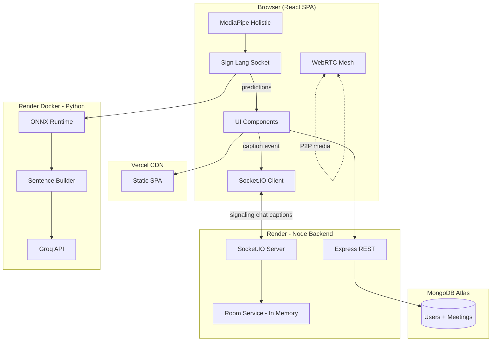

# Apna Meet — Complete Interview Handbook

> **Project:** sign_lang_01 / Apna Meet  
> **Stack:** React 19 + Vite | Node/Express + Socket.IO | MongoDB | Python ONNX + Flask-SocketIO  
> **Deployment:** Vercel (frontend) | Render (backend + sign-language AI)  
> **Purpose:** Study this document end-to-end before any interview. Every answer is grounded in your actual codebase.

---

## How To Use This Handbook

1. Read **Section 1** once to internalize the story.
2. Memorize **Section 10** (Rapid Revision) the night before.
3. Practice **Section 3** answers out loud — 60–90 seconds each.
4. Rehearse **Section 5** STAR stories until they sound natural.
5. Cross-check your resume bullets against **Section 8**.

---

# SECTION 1 — PROJECT DEEP DIVE

## 1.1 What Problem Does It Solve?

Remote meetings are fragmented. Teams jump between Zoom for video, Slack for chat, separate accessibility tools for captions, and spreadsheets for meeting notes. Users who rely on sign language often have no real-time translation inside the call itself.

**Apna Meet** solves this by combining:
- Real-time video/audio calls (WebRTC)
- Live chat and participant management
- Guest join without account friction
- Meeting history with transcripts and analytics
- **Sign-language recognition** with live captions — built into the call, not bolted on

## 1.2 Why Was It Built?

This started as a Zoom-like clone for learning full-stack real-time systems, then evolved into a **production-grade accessibility platform**. The differentiator is not "another video app" — it is **inclusive communication**: gesture inference, sentence building, and AI-assisted caption correction running alongside a stable call experience.

## 1.3 Target Users

| User | Need |
|------|------|
| Students / remote teams | Quick 6-letter room codes, guest join |
| Registered users | Meeting history, stats, starred calls |
| Deaf/HoH community & allies | Real-time sign-language captions |
| Admins | Audit logs for security compliance |

## 1.4 Business Value

- **Accessibility moat:** Sign-language AI inside the meeting is rare in student/portfolio projects.
- **Full product thinking:** Auth, persistence, deployment, security — not just a demo.
- **Operational readiness:** CSRF, rate limits, smoke tests, graceful shutdown, health endpoints.
- **Scalable architecture path:** Media on P2P WebRTC; heavy ML isolated in Python service.

## 1.5 Key Features

| Feature | Implementation |
|---------|----------------|
| Video/audio calls | WebRTC mesh P2P (`useWebRTC.js`) |
| Screen sharing | `getDisplayMedia` + `replaceTrack` |
| Live chat | Socket.IO `chat-message` event |
| Guest join | Public `/:url` route, socket guest auth |
| Auth | JWT httpOnly cookies + refresh rotation |
| Meeting history | MongoDB `Meeting` model, REST CRUD |
| Sign language | MediaPipe → ONNX → captions + Groq correction |
| Speaker view | Audio level detection (`useAudioLevel.js`) |
| Security | CSRF, Helmet, rate limits, Zod socket schemas |

## 1.6 Core Workflow (User Journey)

```
1. User lands on / or /auth
2. Creates account OR joins as guest
3. Generates 6-letter code on /home → navigates to /abcdef
4. Lobby: preview camera, enter name, click Join
5. Socket emits join-room → receives room-joined with peers
6. WebRTC: offer/answer/ICE exchanged via Socket.IO signaling
7. Optional: enable sign language → landmarks sent to Python server
8. Captions broadcast to room via caption socket event
9. End call → PATCH meeting history → disconnect → /home
```

## 1.7 Architecture Overview (One Paragraph)

The browser runs a React SPA that handles UI, WebRTC peer connections, and MediaPipe landmark extraction. A Node/Express server provides REST APIs for auth and meeting persistence, plus a Socket.IO layer for signaling, chat, and caption relay — it never touches media streams. MongoDB stores users and meeting documents. A separate Python Flask-SocketIO service runs ONNX inference on 1530-dimensional landmark vectors and returns gesture predictions; sentence building and optional Groq correction turn raw signs into readable captions. Frontend deploys on Vercel; backend and ML service on Render.

## 1.8 Elevator Pitches

**30 seconds:**
> Apna Meet is a real-time video meeting app with guest join, authenticated accounts, chat, meeting history, screen sharing, and sign-language translation. WebRTC carries media peer-to-peer, Socket.IO handles signaling and messaging, MongoDB stores user and meeting data, and a Python ONNX service performs gesture inference.

**60 seconds:**
> I built Apna Meet because remote meetings shouldn't force users to juggle separate tools for video, chat, accessibility, and session tracking. The frontend is React with WebRTC for media and Socket.IO for control-plane events. The backend is Express with JWT cookie auth, CSRF protection, and MongoDB for meeting history. The differentiator is a decoupled Python inference service — MediaPipe extracts hand and face landmarks in the browser, sends them to an ONNX model, and captions flow back into the call. I deployed it as three services: Vercel for the SPA, Render for Node, and Docker on Render for the ML server.

---

# SECTION 2 — COMPLETE PROJECT ARCHITECTURE

## 2.1 Frontend

### Technologies
| Tech | Version | Role |
|------|---------|------|
| React | 19 | UI components |
| Vite | 7 | Build tool, dev server port 8000 |
| React Router | 7 | Client-side routing |
| MUI | 7 | Auth forms, dialogs |
| Framer Motion | 12 | Page/panel animations |
| Socket.IO Client | 4.8 | Real-time signaling |
| Axios | — | REST with interceptors |
| MediaPipe Holistic | CDN | Landmark extraction |

### Why Chosen
- **Vite over Next.js:** SPA meeting app, no SEO need, faster HMR.
- **MUI:** Polished forms quickly; accessibility defaults on inputs.
- **Framer Motion:** Premium feel without custom animation engine.
- **No Redux:** Context + hooks sufficient; WebRTC state is hook-local.

### Component Structure
```
frontend/src/
├── pages/           VideoMeet, home, landing, auth, history
├── components/
│   ├── video/       Lobby, VideoGrid, VideoTile, ControlBar, MeetingTopBar
│   ├── chat/        ChatPanel
│   └── common/      ProtectedRoute, ErrorBoundary, PageTransition
├── hooks/           useWebRTC, useChat, useSignLanguage, useAudioLevel
├── contexts/        AuthContext
├── services/        api.js, socket.js, tokenStore.js
├── styles/          tokens.css, videoComponent.module.css
└── utils/           constants.js, helpers.js, motion.js
```

### State Management
- **AuthContext:** user, login/logout, meeting CRUD
- **useWebRTC:** peer connections, streams, media toggles
- **useChat:** messages, badge count
- **useSignLanguage:** captions, server health
- **VideoMeet.jsx:** orchestrator — lobby, panels, layout, duration

### Routing
| Path | Auth | Page |
|------|------|------|
| `/` | Public | Landing |
| `/auth` | Public | Login/Register |
| `/home` | Protected | Create/join meeting |
| `/history` | Protected | Meeting history |
| `/:url` | Public | Video meeting (6-letter code) |

**Critical:** `/:url` is registered last — catches meeting codes like `/abcdef`.

### Performance Optimizations
- React Compiler (babel-plugin-react-compiler)
- `React.memo` on VideoGrid, VideoTile, ControlBar
- Gallery pagination: 16 tiles/page when >25 participants
- Adaptive bitrate tiers by peer count (`BITRATE_TIERS`)
- Shared singleton AudioContext for speaking detection
- Sign-language throttling: 150ms interval, motion delta gating
- Landmark send capped; server rate limits at 120/10s

### Responsiveness
- Floating pill control bar with horizontal scroll on mobile
- CSS design tokens (`tokens.css`) for consistent spacing
- Gallery grid adapts 1–25+ participants via `getGridLayout()`

### Accessibility
- `aria-label`, `aria-pressed`, `aria-live` on controls and chat
- `useReducedMotion()` disables Framer animations
- Keyboard shortcuts: M (mute), V (video), C (chat), P (people), Esc (close panels)
- Mesh performance warning banner when >12 participants

### Tradeoffs
| Decision | Pro | Con |
|----------|-----|-----|
| Mesh WebRTC | No media server cost | O(n²) connections; degrades >12 peers |
| Hook-based state | Simple, testable | No time-travel debugging |
| CSS Modules + tokens | Scoped styles | Not a full design system |
| Separate sign-lang socket | Isolates ML latency | Two Socket.IO connections |

---

## 2.2 Backend

### API Architecture
REST under `/api/v1` + Socket.IO on same HTTP server.

**HTTP Endpoints:**

| Method | Path | Auth | Purpose |
|--------|------|------|---------|
| GET | `/health` | None | Status, DB, room stats |
| GET | `/api/v1/auth/csrf-token` | CSRF bootstrap | Get XSRF token |
| POST | `/api/v1/auth/register` | Rate limited | Create account |
| POST | `/api/v1/auth/login` | Rate limited | Login |
| POST | `/api/v1/auth/refresh` | CSRF | Rotate tokens |
| POST | `/api/v1/auth/logout` | Optional | Clear session |
| POST | `/api/v1/auth/forgot-password` | Rate limited | Reset email |
| POST | `/api/v1/auth/reset-password` | Rate limited | Set new password |
| GET | `/api/v1/auth/me` | Required | Current user |
| GET | `/api/v1/auth/audit-logs` | Admin | Audit trail |
| GET | `/api/v1/meetings/stats` | Required | Aggregated stats |
| POST | `/api/v1/meetings/` | Required | Save meeting |
| GET | `/api/v1/meetings/` | Required | Paginated history |
| PATCH | `/api/v1/meetings/:id` | Required | Update meeting |
| DELETE | `/api/v1/meetings/:id` | Required | Delete meeting |

**Socket Events (Client → Server):**
`join-room`, `leave-room`, `media-state-update`, `get-room-info`, `chat-message`, `offer`, `answer`, `ice-candidate`, `renegotiate`, `caption`

**Socket Events (Server → Client):**
`room-joined`, `user-joined`, `user-left`, `host-changed`, `peer-media-update`, `chat-message`, `offer`, `answer`, `ice-candidate`, `renegotiate`, `caption`, `error`

### Folder Structure
```
backend/src/
├── app.js                 Server bootstrap, shutdown
├── config/                index.js, cors.js, db.js
├── controllers/           auth, meeting, socket handlers
├── middleware/            auth, csrf, rateLimiter, validate, errorHandler
├── models/                user.model.js, meeting.model.js
├── routes/                auth.routes.js, meeting.routes.js
├── services/              jwt, room, audit, email
├── validators/            Zod schemas for HTTP
└── utils/                 clientIp.js
```

### Authentication Flow
1. User registers/logs in → server sets `accessToken` + `refreshToken` httpOnly cookies
2. Access token: 15 min; Refresh: 7 days
3. Refresh stored in MongoDB — rotation on each refresh; reuse = "Token reuse detected"
4. Socket auth: reads cookie or `handshake.auth.token`; guests allowed without auth
5. CSRF: double-submit cookie (`XSRF-TOKEN`) + `X-XSRF-TOKEN` header on auth routes

### Authorization
- `requireAuth` middleware on protected REST routes
- `user.role === "admin"` for audit logs
- Meeting PATCH/DELETE scoped to `user_id` owner
- Chat sender always from `socket.username` — client cannot spoof

### Error Handling
- Global `errorHandler` — hides stack in production
- Socket errors: `{ message, code, event }` — codes: `INVALID_PAYLOAD`, `RATE_LIMIT`, `INVALID_PEER`
- Mongoose validation errors formatted for client
- `notFoundHandler` for 404

### Validation
- HTTP: Zod via `validate()` middleware (`auth.validator.js`)
- Socket: Zod in `schemas.js` — `joinRoomSchema`, `chatSchema`, `offerSchema`, etc.
- Room codes: exactly 6 lowercase letters (`^[a-z]{6}$`)

### Security Measures
| Layer | Implementation |
|-------|----------------|
| Headers | Helmet (CSP disabled for SPA) |
| HTTPS | Prod redirect if not secure |
| CORS | Strict origin list + `.vercel.app` regex |
| Rate limit | HTTP: 100/15min general; Socket: per-event limits |
| Lockout | 5 failed logins → 30 min lock |
| Password | bcrypt 12 rounds |
| Signaling | Same-room peer validation; SDP size caps (50KB) |
| IP parsing | `clientIp.js` handles `x-forwarded-for` chains |

### Tradeoffs
| Decision | Pro | Con |
|----------|-----|-----|
| In-memory rooms | O(1) lookups, simple | Lost on restart; no multi-instance |
| Cookie auth | XSS-resistant vs localStorage | Needs CSRF; cross-origin complexity |
| Mesh signaling only | Server never touches media | Doesn't scale to 50+ smoothly |
| File audit logs | Simple compliance | Not queryable like DB |

---

## 2.3 Database (MongoDB)

### User Schema
```
name, username (unique), email (optional unique), password (bcrypt)
refreshToken, role (user|admin)
emailVerified, emailVerificationToken, emailVerificationExpires
passwordResetToken, passwordResetExpires
loginAttempts, lockUntil, lastLoginAt, lastLoginIP
timestamps: createdAt, updatedAt
```

### Meeting Schema
```
user_id (ref User), meetingCode, title
date, endedAt, duration (seconds)
participants: [String]
chatMessageCount, signDetections: [{label, count}]
chatTranscript: [{sender, text, timestamp}]
meetingSummary (auto-generated on PATCH)
starred: Boolean
Index: { user_id: 1, date: -1 }
```

### Why MongoDB Over PostgreSQL
- Meeting documents are nested (transcripts, sign detections evolve)
- Flexible schema during rapid iteration
- Aggregation for stats (`getStats` controller)

### Query Optimization
- Index on `user_id + date` for history pagination
- Stats cached 30s per user in controller memory
- Pagination: `page`, `limit` (max 50), `search`, `starred` filter

### Tradeoffs
- **Pro:** Fast document writes for meeting end-of-call PATCH
- **Con:** No JOINs; relational analytics harder than SQL
- **Con:** No transactions across user + meeting in complex flows

---

## 2.4 Sign-Language ML Service

### Pipeline
```
Capture (MediaPipe) → 1530-D vector → Normalize → ONNX MLP → Softmax → Label
→ SentenceBuilder → Groq correction → Caption broadcast
```

### Feature Vector (1530 dimensions)
- Left hand: 21 × 3 = 63
- Right hand: 21 × 3 = 63
- Face: 468 × 3 = 1404
- Total: 1530 (hand-only mode zero-pads face section)

### Model
Default MLP: `1530 → 512 → 256 → num_classes → Softmax`
14 sign classes: Hello, Yes, No, Thank You, I Love You, etc.

### Deployment
- Docker on Render (Python 3.11)
- Gunicorn + gevent worker
- Rate limits: 20 connections/min/IP, 120 landmarks/10s/session
- Health: `/health` endpoint
- CORS via `CORS_ORIGINS` env var

### Why Separate Service
- CPU-heavy inference must not block Node signaling
- Independent scaling and deployment
- Model updates without backend redeploy

---

## 2.5 Deployment

| Service | Host | Config |
|---------|------|--------|
| Frontend | Vercel | `vercel.json` SPA rewrite |
| Backend | Render | `npm start`, trust proxy, MongoDB Atlas |
| Sign-lang | Render Docker | `Dockerfile`, gunicorn + gevent |

### Environment Variables
| Service | Key Vars |
|---------|----------|
| Backend | `MONGODB_URI`, `JWT_*`, `FRONTEND_URL`, `SMTP_*`, `ROOM_MAX_PARTICIPANTS` |
| Frontend | `VITE_API_URL`, `VITE_SIGN_LANG_URL`, `VITE_TURN_*` |
| Sign-lang | `CORS_ORIGINS`, `SOCKETIO_ASYNC_MODE`, `GROQ_API_KEY` |

### Monitoring
- `/health` — DB status, uptime, room stats, limits
- `/api/metrics` on sign-lang server
- File audit logs (`backend/logs/audit.log`)
- Smoke tests: `test:security`, `test:socketschema`, `test:clientip`

### Graceful Shutdown
`SIGTERM` → `shutdownSocket()` → `roomService.destroy()` → `server.close()` → MongoDB close

---

# SECTION 3 — 100 MOST LIKELY TECHNICAL QUESTIONS

> Format: **Q** | **Intent** | **Answer (60–90s)** | **Follow-ups** | **Red flags**

---

## BEGINNER (20 Questions)

### B1. What is Apna Meet?
**Intent:** Can you explain your project simply?  
**Answer:** Apna Meet is a real-time video meeting platform I built — think Zoom, but with sign-language translation built in. Users can join with a 6-letter room code as guests or create accounts for meeting history. WebRTC handles video peer-to-peer, Socket.IO handles signaling and chat, MongoDB stores users and meetings, and a Python ONNX service recognizes hand gestures and shows live captions.  
**Follow-ups:** Who are the users? What makes it different from Zoom?  
**Red flags:** Describing it as "just a clone" without mentioning accessibility or architecture.

### B2. What tech stack did you use?
**Intent:** Verify you know your own stack.  
**Answer:** Frontend is React 19 with Vite, MUI for forms, Framer Motion for animations, and Socket.IO client for real-time events. Backend is Node with Express 5, Socket.IO 4, and Mongoose for MongoDB. Auth uses JWT in httpOnly cookies with CSRF protection. The sign-language piece is a separate Python service — Flask-SocketIO, ONNX Runtime, and MediaPipe runs in the browser to extract landmarks. Deployed on Vercel for frontend and Render for both backend services.  
**Follow-ups:** Why not Next.js? Why Python separately?  
**Red flags:** Listing technologies without explaining roles.

### B3. How does a user join a meeting?
**Intent:** Understand user flow.  
**Answer:** From the home page, a user generates or enters a 6-letter lowercase code like `abcdef`, which navigates to `/abcdef`. They land in a lobby where they preview their camera and enter a display name. On join, the frontend emits `join-room` over Socket.IO with the room code and username. The server adds them to the in-memory room, returns existing participants via `room-joined`, and notifies others with `user-joined`. Then WebRTC peer connections are established for each existing participant.  
**Follow-ups:** Can guests join? What if the room is full?  
**Red flags:** Saying users need an account to join.

### B4. What is WebRTC and why did you use it?
**Intent:** Basic real-time media knowledge.  
**Answer:** WebRTC is a browser API for peer-to-peer audio, video, and data. I used it because media should flow directly between browsers — not through my server. That keeps latency low and avoids expensive media relay infrastructure. My Node server only relays signaling messages — offers, answers, and ICE candidates — via Socket.IO. The actual video streams never touch the backend.  
**Follow-ups:** What happens behind strict NAT? What is ICE?  
**Red flags:** Saying video goes through the server.

### B5. What is Socket.IO used for in your project?
**Intent:** Distinguish signaling from media.  
**Answer:** Socket.IO is the control plane. It handles room join/leave, WebRTC signaling — offers, answers, ICE candidates — live chat, caption broadcasting, and media state updates like mute/unmute notifications. It is not carrying video frames. I chose it over raw WebSockets because it has automatic reconnection, fallback transports, and a cleaner event-based API.  
**Follow-ups:** Why not WebRTC data channels for everything?  
**Red flags:** Confusing Socket.IO with WebRTC media transport.

### B6. What database do you use and what do you store?
**Intent:** Persistence layer understanding.  
**Answer:** MongoDB via Mongoose. I store two main collections: Users — with hashed passwords, refresh tokens, email verification, lockout state — and Meetings — with meeting codes, duration, participant names, chat transcripts, sign detection counts, and auto-generated summaries. Live room state during a call is in-memory on the server, not in MongoDB. Meeting history is written when the call ends via a PATCH request.  
**Follow-ups:** Why MongoDB over SQL?  
**Red flags:** Saying everything is in the database including live room state.

### B7. How does authentication work?
**Intent:** Security basics.  
**Answer:** On login or register, the server issues a short-lived access token — 15 minutes — and a longer refresh token — 7 days — both stored in httpOnly cookies so JavaScript cannot read them. The access token is sent automatically on API requests. When it expires, the frontend calls `/auth/refresh` to rotate both tokens. Refresh tokens are also stored in MongoDB so I can detect reuse — if someone tries an old refresh token, I invalidate the session. Guests can join meetings without logging in.  
**Follow-ups:** Why cookies instead of localStorage?  
**Red flags:** Storing JWT in localStorage without mentioning XSS risk.

### B8. What is CSRF and why do you need it?
**Intent:** Security awareness with cookie auth.  
**Answer:** CSRF — Cross-Site Request Forgery — is when a malicious site tricks a logged-in user's browser into making requests to my API using their cookies. Because I use httpOnly cookies for auth, I need CSRF protection on mutating routes like login and register. I use a double-submit pattern: the server sets an `XSRF-TOKEN` cookie that JavaScript can read, and the client sends that value back in the `X-XSRF-TOKEN` header. The server verifies they match.  
**Follow-ups:** Why only on auth routes? SameSite cookies?  
**Red flags:** Saying "we don't need CSRF with JWT."

### B9. How does chat work in a meeting?
**Intent:** Real-time messaging implementation.  
**Answer:** When a user sends a chat message, the frontend emits `chat-message` with the text. The server validates it with Zod — max 2000 characters — rate-limits to 20 messages per 10 seconds, and critically sets the sender from `socket.username`, not from the client payload. That prevents sender spoofing. The message is stored in the in-memory room history — last 100 messages — and broadcast to everyone in the room via Socket.IO.  
**Follow-ups:** Is chat persisted? Can users impersonate others?  
**Red flags:** Not knowing about the sender spoofing fix.

### B10. What is sign-language recognition in your app?
**Intent:** Core differentiator.  
**Answer:** When a user enables sign language, MediaPipe Holistic runs on their camera feed in the browser and extracts 3D landmarks for both hands and face — 1530 numbers total. Those landmarks are sent to my Python ONNX server, which classifies the gesture against 14 trained signs like Hello, Yes, No. Predictions above 0.6 confidence show as captions. A sentence builder buffers words and optionally sends them to Groq for grammar correction. Captions are broadcast to all participants via the main Socket.IO connection.  
**Follow-ups:** Why not run ML in the browser? Why ONNX?  
**Red flags:** Vague "AI does sign language" without explaining the pipeline.

### B11. What is a room code and how is it validated?
**Intent:** Input validation.  
**Answer:** Room codes are exactly 6 lowercase letters, validated with regex `^[a-z]{6}$` on both frontend and backend. The frontend generates random codes on the home page. When joining via socket, the server rejects invalid formats before adding the user to a room. Rooms are auto-created when the first person joins — that person becomes the host.  
**Follow-ups:** What happens when the host leaves?  
**Red flags:** Allowing arbitrary strings as room codes.

### B12. What is the lobby screen?
**Intent:** UX flow before joining.  
**Answer:** The lobby is a pre-join screen where users preview their camera and microphone, enter a display name — especially important for guests — and click Join. Only after joining does the app emit `join-room` and start WebRTC connections. This prevents other participants from seeing a blank or uninitialized stream, and gives users a chance to fix permissions before entering the call.  
**Follow-ups:** What media permissions are requested?  
**Red flags:** Joining the room immediately on page load.

### B13. What is screen sharing?
**Intent:** Media feature understanding.  
**Answer:** Screen sharing uses the browser's `getDisplayMedia` API to capture the user's screen as a video track. I replace the outgoing video track on the peer connection with the screen track using `replaceTrack`. When sharing stops, I swap back to the camera track. Screen sharing works alongside sign language because sign detection uses a separate camera stream, not the screen track.  
**Follow-ups:** Does screen share affect sign language?  
**Red flags:** Not knowing about track replacement.

### B14. What is meeting history?
**Intent:** Persistence feature.  
**Answer:** When an authenticated user ends a call, the frontend PATCHes the meeting document with duration, participant list, chat transcript, and sign detection counts. Users can view paginated history on `/history` with search and star favorites. The backend also generates a text summary from keywords in the transcript and sign stats. Stats like total duration and most-used rooms are aggregated with a 30-second cache.  
**Follow-ups:** What about guest meetings?  
**Red flags:** Saying all meetings are saved automatically for everyone.

### B15. What is guest join?
**Intent:** Access model.  
**Answer:** The `/:url` meeting route is public — no login required. Guests enter a display name in the lobby and join with `socket.authenticated = false`. They get full video, chat, and sign-language features but no meeting history is saved. The socket auth middleware allows unauthenticated connections and uses the provided username or defaults to "Guest".  
**Follow-ups:** Security implications of guest join?  
**Red flags:** Requiring auth for all meetings.

### B16. What ports do your services run on locally?
**Intent:** Dev environment knowledge.  
**Answer:** Frontend on 8000 via Vite, backend on 8001 via Express, and the sign-language Python server on 5000. MongoDB connects to Atlas or local instance. Environment variables wire them together — `VITE_BACKEND_URL` and `VITE_SIGN_LANG_URL` on the frontend.  
**Follow-ups:** How does production differ?  
**Red flags:** Not knowing local vs production URLs.

### B17. What is bcrypt used for?
**Intent:** Password security.  
**Answer:** bcrypt hashes passwords before storing them in MongoDB. I use 12 rounds configured in the User model's pre-save hook. On login, `comparePassword` checks the plaintext against the hash. Passwords are never stored or logged in plaintext. I also enforce a minimum length via Zod validators on the auth routes.  
**Follow-ups:** Why not SHA-256? Salting?  
**Red flags:** Storing plaintext passwords.

### B18. What is rate limiting in your project?
**Intent:** Abuse prevention.  
**Answer:** I have multiple layers. HTTP: 100 requests per 15 minutes globally, 15 auth attempts per 15 minutes, tighter limits on stats and read endpoints. Socket: per-event limits — e.g., 20 chat messages per 10 seconds, 60 signaling events per 10 seconds, 20 connections per minute per IP. The sign-language server limits 120 landmark frames per 10 seconds per session. Each layer returns a clear error code like `RATE_LIMIT`.  
**Follow-ups:** What happens when limit is hit? Redis for distributed limiting?  
**Red flags:** No rate limiting at all.

### B19. How is the frontend deployed?
**Intent:** Deployment knowledge.  
**Answer:** The React SPA builds with Vite to a `dist` folder and deploys on Vercel. `vercel.json` rewrites all routes to `index.html` for client-side routing. Environment variables `VITE_API_URL` and `VITE_SIGN_LANG_URL` point to the Render backend and sign-language services. The backend CORS config allows Vercel domains including `*.vercel.app` in production.  
**Follow-ups:** How do env vars work with Vite?  
**Red flags:** Not knowing SPA rewrite requirement.

### B20. What was the hardest part of this project?
**Intent:** Self-awareness and depth.  
**Answer:** The hardest part was keeping sign-language inference from destabilizing the call. ML is CPU-heavy and can introduce latency, so I deliberately isolated it in a separate Python service with its own Socket.IO connection, client-side throttling, and server-side rate limits. On the WebRTC side, handling glare — when two peers send offers simultaneously — and ICE candidate queuing before remote descriptions are set took significant debugging.  
**Follow-ups:** How did you debug WebRTC issues?  
**Red flags:** "Nothing was hard" or blaming tools.

---

## INTERMEDIATE (40 Questions)

### I1. Explain the WebRTC connection setup in your app.
**Intent:** Deep signaling knowledge.  
**Answer:** When a user joins a room, they receive existing participants via `room-joined`. For each peer, my `useWebRTC` hook creates an `RTCPeerConnection` with Google STUN servers and optional TURN from env vars. The joiner creates an offer, sets local description, emits it via Socket.IO. The remote peer receives `offer`, sets remote description, creates an answer, emits back. Both sides exchange ICE candidates as they are gathered, queued if remote description isn't set yet. I use the "polite peer" pattern to handle glare when both sides offer simultaneously.  
**Follow-ups:** What is ICE gathering? TURN vs STUN?  
**Red flags:** Cannot explain offer/answer flow.

### I2. What is mesh topology and what are its limits?
**Intent:** Scalability awareness.  
**Answer:** Mesh means every participant connects directly to every other participant. In a room with N people, each peer has N-1 connections — O(n²) total. It works well up to about 12 participants, which is why I expose `meshRecommendedMax: 12` in config and show a UI warning above that. Beyond 12, CPU and bandwidth per client grow quickly. The hard cap is 50 participants in room settings, but that's a product limit, not a performance recommendation. To truly scale, I'd need an SFU like mediasoup or LiveKit.  
**Follow-ups:** How would you add an SFU?  
**Red flags:** Claiming mesh scales to 100+ without caveats.

### I3. How does your adaptive bitrate work?
**Intent:** Performance engineering.  
**Answer:** In `useWebRTC.js`, I define `BITRATE_TIERS` that reduce max bitrate as peer count increases. Every 8 seconds, I poll `getStats()` on each peer connection for RTT and packet loss. Based on thresholds in `ADAPTIVE_VIDEO_THRESHOLDS`, I switch video profiles between high, medium, and low resolution. I also apply `ADAPTIVE_BITRATE_FACTORS` to scale the encoded bitrate. This is client-side adaptation — no server involvement — and helps mesh calls survive on average networks.  
**Follow-ups:** What stats do you read? Who encodes the video?  
**Red flags:** Not knowing bitrate is per-peer in mesh.

### I4. Explain your JWT refresh token rotation.
**Intent:** Auth security depth.  
**Answer:** On login, I generate an access and refresh token pair. The refresh token is stored in MongoDB on the user document. When the client calls `/auth/refresh`, I verify the refresh JWT, compare it against what's stored in DB, and if they match, issue a new pair and update the stored refresh token. If someone presents an old refresh token — meaning it was already rotated — I treat that as token reuse, which could indicate theft, and reject the request. Access tokens are short-lived at 15 minutes to limit exposure window.  
**Follow-ups:** What if refresh fails mid-call?  
**Red flags:** Stateless refresh without DB check.

### I5. How does CSRF work with cross-origin deployment?
**Intent:** Production auth complexity.  
**Answer:** My frontend is on Vercel, backend on Render — different origins. Cookies use `SameSite=None; Secure` in production so they cross origins. That makes CSRF more important, not less. On app load, the frontend calls `GET /auth/csrf-token` which sets the `XSRF-TOKEN` cookie. Axios interceptor attaches `X-XSRF-TOKEN` header on POST requests. The CSRF token is also HMAC-signed with a timestamp for a 24-hour TTL. I have a signed fallback for cases where the cookie isn't available cross-site.  
**Follow-ups:** Why not SameSite=Strict?  
**Red flags:** Ignoring cross-origin cookie issues.

### I6. What is Zod validation on socket events?
**Intent:** Input validation at real-time layer.  
**Answer:** Every socket handler parses incoming payloads with Zod schemas in `schemas.js` before processing. For example, `joinRoomSchema` requires a roomCode string and optional username. `offerSchema` validates the target peer ID and SDP object. If parsing fails, the server emits `error` with code `INVALID_PAYLOAD` — it never trusts client shape. I also cap SDP size at 50KB and ICE candidates at 10KB to prevent abuse. A smoke test script validates all schemas on CI.  
**Follow-ups:** Why Zod over manual checks?  
**Red flags:** Trusting socket payloads without validation.

### I7. How do you prevent chat sender spoofing?
**Intent:** Security fix awareness.  
**Answer:** Originally, the chat handler could trust a `sender` field from the client payload — a user could impersonate anyone. I fixed this so `sender` is always set from `socket.username`, which comes from authenticated JWT or the guest name provided at join. The client payload only supplies the message text. This is a classic trust-boundary mistake in real-time apps — never trust client identity fields when the server already knows who the socket is.  
**Follow-ups:** What other fields could be spoofed?  
**Red flags:** Not aware of the vulnerability.

### I8. Explain the room service in-memory architecture.
**Intent:** Backend state management.  
**Answer:** `room.service.js` is a singleton holding three Maps: `rooms` keyed by room code, `socketToRoom` mapping socket IDs to rooms, and `socketToUser` for participant info. When someone joins, they're added to the room's participant Map. When they leave or disconnect, they're removed. If the host leaves, host transfers to the next participant. Empty rooms are deleted immediately. Messages are capped at 100 in memory. This is fast but not durable — restart loses all active rooms.  
**Follow-ups:** How to scale across multiple server instances?  
**Red flags:** Claiming rooms survive server restart.

### I9. How does speaker view work?
**Intent:** UI/UX engineering.  
**Answer:** Each `VideoTile` runs `useAudioLevel` which taps the audio stream through a shared singleton AudioContext. Audio levels are smoothed and compared against a threshold to detect speaking. Levels are reported to `VideoMeet.jsx` every 120ms. In speaker layout mode, the loudest remote participant is auto-spotlighted. Users can also manually pin a participant, which switches to gallery mode with that person enlarged. When someone else is spotlighted, a draggable local PiP shows your own camera.  
**Follow-ups:** Performance cost of audio analysis?  
**Red flags:** Using video motion for speaking detection.

### I10. How does sign-language throttling work on the client?
**Intent:** ML pipeline efficiency.  
**Answer:** In `useSignLanguage.js`, MediaPipe runs on every frame but landmarks are only sent when: at least 150ms has passed since last send, the landmark delta exceeds a motion threshold, or 1.5 seconds forced full send elapsed. This cuts bandwidth and server load from ~30fps to ~6-7fps. If the server returns a slowdown event, the client backs off further. Confidence below 0.6 is filtered out. Multiple signers are tracked with per-user remote caption timers.  
**Follow-ups:** Why send from client not server?  
**Red flags:** Sending every frame unthrottled.

### I11. What is ONNX and why use it over PyTorch at inference?
**Intent:** ML deployment knowledge.  
**Answer:** ONNX is an open format for representing ML models. I train in PyTorch, export to `model.onnx`, and run inference with ONNX Runtime in production. ONNX Runtime is optimized for CPU inference with graph optimizations enabled — `ORT_ENABLE_ALL`. The Python server loads the model once at startup and runs `session.run()` per landmark vector. This is faster and lighter than keeping PyTorch as a production dependency. The training dependencies — torch, mediapipe, opencv — aren't even in `requirements-render.txt`.  
**Follow-ups:** Model input/output shapes? Quantization?  
**Red flags:** Running PyTorch in production unnecessarily.

### I12. Explain the 1530-dimensional feature vector.
**Intent:** ML feature engineering.  
**Answer:** MediaPipe Holistic detects 21 landmarks per hand — x, y, z each — so 126 values for both hands. The face mesh adds 468 landmarks × 3 = 1404 values. Total: 1530 floats. Before inference, I normalize: center on face mean if visible else hand mean, subtract reference, divide by standard deviation. This makes the model invariant to position and scale. In hand-only mode, face landmarks are zero-padded but vector length stays 1530 for model compatibility.  
**Follow-ups:** Why include face landmarks?  
**Red flags:** Not knowing the vector composition.

### I13. How does meeting summary generation work?
**Intent:** Backend business logic.  
**Answer:** When a meeting is PATCHed at end-of-call, `meeting.controller.js` runs `buildMeetingSummary()` if not already set. It extracts keywords from the chat transcript, counts sign detection labels, and composes a short text summary — no external AI on the backend. This gives users a quick recap without another API dependency. Summaries are stored on the Meeting document alongside the full transcript.  
**Follow-ups:** Why not use GPT for summaries?  
**Red flags:** Not knowing summaries are rule-based.

### I14. What happens on socket disconnect?
**Intent:** Cleanup and reliability.  
**Answer:** On `disconnect`, `handleDisconnect` in socket index calls `roomService.leaveRoom(socket.id)`. If the user was in a room, remaining participants get `user-left` with their socketId and username. If the leaver was host, `host-changed` fires with the new host's socketId — but only on explicit leave, not disconnect. WebRTC peers handle `user-left` by closing the peer connection and removing the remote stream. Socket.IO has connection state recovery enabled for 2-minute reconnect windows.  
**Follow-ups:** Host transfer on disconnect? ICE restart?  
**Red flags:** Orphaned peer connections.

### I15. How does the Axios interceptor handle token refresh?
**Intent:** Frontend auth resilience.  
**Answer:** The API client in `api.js` attaches credentials and CSRF headers. On 401, it attempts refresh via `/auth/refresh`, retries the original request with new cookies, and dispatches `auth:expired` if refresh fails. During an active call, auth expiry doesn't redirect — `AuthContext` checks if user is in a meeting. Refresh token is also stored in localStorage as `apna_meet_rt` fallback for cross-origin cases where cookies don't persist.  
**Follow-ups:** Race conditions on concurrent 401s?  
**Red flags:** Redirecting mid-call on token expiry.

### I16. Explain CORS configuration.
**Intent:** Cross-origin security.  
**Answer:** `cors.js` builds an allowlist from `FRONTEND_URL` and `FRONTEND_URLS` env vars. In production, it also allows any `*.vercel.app` subdomain via regex. Socket.IO CORS mirrors the same origins with credentials enabled. The sign-language server has its own `CORS_ORIGINS` env var. Wrong CORS is a common production bug — I debugged this when Vercel preview deployments couldn't reach the backend.  
**Follow-ups:** What is a preflight request?  
**Red flags:** Using `origin: *` with credentials.

### I17. What is the health endpoint used for?
**Intent:** Ops and monitoring.  
**Answer:** `GET /health` returns server status, MongoDB connection state, uptime, in-memory room stats from `roomService.getStats()`, and participant limits — max 50, mesh recommended 12. The server starts listening before MongoDB connects so health checks pass during deploy. Security smoke test script hits this endpoint in CI. It's the first thing I check when debugging production issues.  
**Follow-ups:** Liveness vs readiness?  
**Red flags:** No health endpoint.

### I18. How does gallery pagination work for large calls?
**Intent:** UI scalability.  
**Answer:** When participant count exceeds `GALLERY_THRESHOLD` of 25, `VideoGrid` paginates — showing 16 tiles per page via `GALLERY_PAGE_SIZE`. Users navigate pages with prev/next controls. This prevents rendering 50 video elements simultaneously, which would crush mobile performance. Layout is computed by `getGridLayout()` for smaller counts. A banner warns when count exceeds `MESH_RECOMMENDED_MAX` of 12 about quality degradation.  
**Follow-ups:** Virtualization instead of pagination?  
**Red flags:** Rendering all 50 tiles at once.

### I19. What is account lockout?
**Intent:** Brute force protection.  
**Answer:** After 5 failed login attempts, `user.model.js` sets `lockUntil` to 30 minutes in the future. `isLocked` checks this before password comparison. Successful login calls `resetLoginAttempts`. This works alongside HTTP `authLimiter` at 15 attempts per 15 minutes per IP. Together they protect against credential stuffing without locking legitimate users too aggressively.  
**Follow-ups:** Reset on password reset?  
**Red flags:** Unlimited login attempts.

### I20. How does caption broadcasting work?
**Intent:** Cross-service integration.  
**Answer:** When sign language detects a gesture, `useSignLanguage` emits `caption` on the main meeting socket with text, score, and isSentence flag. `signalingHandler.js` validates with Zod, rate-limits to 30 per 10 seconds, and relays to all peers in the room except sender. `CaptionOverlay` displays local, remote, and AI-corrected sentences. Corrected sentences from Groq come back on the sign-language socket as `corrected_sentence` and are also broadcast. Captions do not use WebRTC data channels in the main app.  
**Follow-ups:** README mentions data channels — discrepancy?  
**Red flags:** Not knowing caption path.

### I21–I40. (Condensed intermediate — study these topics deeply)

| # | Question | Core Answer Point |
|---|----------|-------------------|
| I21 | ICE candidate queuing? | Queue candidates until `remoteDescription` set, then flush — prevents race conditions |
| I22 | Renegotiation flow? | `renegotiate` event triggers new offer when tracks added/removed (screen share) |
| I23 | Why httpOnly cookies? | JS cannot read them — reduces XSS token theft vs localStorage |
| I24 | Email verification flow? | Token generated on register, 24h expiry, `verify-email` endpoint |
| I25 | Forgot password security? | Always returns 200 to prevent email enumeration; SMTP or dev token |
| I26 | Audit logging? | JSON lines to `audit.log`; auth events + middleware for API paths |
| I27 | Helmet middleware? | Security headers; CSP disabled for SPA compatibility |
| I28 | trust proxy setting? | `app.set("trust proxy", 1)` for correct IP behind Render/Vercel |
| I29 | Socket connection rate limit? | 20 connections/min per IP at socket middleware level |
| I30 | INVALID_PEER error? | Offer/answer rejected if target not in same room — prevents cross-room attacks |
| I31 | Groq integration? | `groq_api_secure.py` corrects sentence grammar; optional API key |
| I32 | SentenceBuilder? | Buffers words ≥0.8 confidence; 2s pause triggers sentence |
| I33 | Design tokens? | `tokens.css` — CSS variables for colors, spacing, typography |
| I34 | useReducedMotion? | Framer Motion respects `prefers-reduced-motion` for accessibility |
| I35 | React Compiler? | babel-plugin-react-compiler for auto-memoization |
| I36 | ProtectedRoute? | Redirects to `/auth` if not authenticated; shows spinner while loading |
| I37 | Meeting stats cache? | 30s in-memory cache per user; invalidated on mutations |
| I38 | Graceful shutdown? | SIGTERM → close sockets → clear rooms → close HTTP → close MongoDB |
| I39 | Env hygiene check? | Script validates required prod vars before deploy |
| I40 | Sign server health? | Frontend polls `/api/metrics`; shows degraded banner |

---

## ADVANCED (40 Questions)

### A1. How would you scale this to multiple backend instances?
**Intent:** Distributed systems thinking.  
**Answer:** Today, rooms live in memory on one Node process — a second instance wouldn't share state. To scale horizontally, I'd add the Socket.IO Redis adapter so events broadcast across instances. Room state would move to Redis with TTL. Sticky sessions or consistent hashing would route sockets to the right instance. MongoDB already externalizes persistence. Media stays P2P so backend scaling only affects signaling and chat, not video bandwidth. I'd also add Redis for distributed rate limiting instead of in-memory Maps.  
**Follow-ups:** CAP theorem tradeoffs? Redis data structures for rooms?  
**Red flags:** "Just add more servers."

### A2. Why not use an SFU for media?
**Intent:** Architecture tradeoff depth.  
**Answer:** An SFU — Selective Forwarding Unit — would receive each participant's stream once and forward to others, giving O(n) bandwidth per client instead of O(n²). I chose mesh because it's simpler — no media server to deploy, operate, or pay for — and sufficient for MVP target of ~12 participants. Adding mediasoup or LiveKit is the clear next step for 50+ users. The signaling layer I built is compatible — I'd replace peer connections with SFU subscriptions while keeping Socket.IO for room events.  
**Follow-ups:** mediasoup vs LiveKit? Simulcast?  
**Red flags:** Not knowing mesh vs SFU difference.

### A3. How would you implement TURN for production WebRTC?
**Intent:** NAT traversal knowledge.  
**Answer:** STUN only helps when NAT is permissive. For corporate networks and symmetric NAT, TURN relays media. I already support optional TURN via `VITE_TURN_URL`, `VITE_TURN_USERNAME`, `VITE_TURN_CREDENTIAL` in `ICE_SERVERS`. Production would use a managed TURN service like Twilio, Cloudflare Calls, or self-hosted coturn. Tradeoff: TURN increases latency and cost because media flows through a relay. I'd monitor TURN usage and only relay when direct connection fails.  
**Follow-ups:** STUN vs TURN vs ICE?  
**Red flags:** "STUN is enough for production."

### A4. Explain the polite peer / glare handling pattern.
**Intent:** WebRTC edge case expertise.  
**Answer:** Glare happens when two peers send offers simultaneously. I track `makingOffer` per peer. When receiving an offer while we're also making one, the "polite" peer — typically the joiner — rolls back its local offer and accepts the remote one. The "impolite" peer ignores the incoming offer if it conflicts. This prevents stuck connections. It's implemented with refs in `useWebRTC.js` to avoid stale closures in socket handlers.  
**Follow-ups:** Perfect negotiation pattern?  
**Red flags:** Never heard of glare.

### A5. Security audit: what would you improve?
**Intent:** Honest security assessment.  
**Answer:** Three gaps I'd fix: One, CSRF is only on auth routes — meeting PATCH/DELETE use cookie auth without CSRF, which is a risk if an attacker triggers cross-site requests. Two, in-memory rate limits don't work across instances. Three, refresh tokens in response body are a fallback for cross-origin but increase XSS surface if stored in localStorage. I'd add CSRF to meeting routes, Redis rate limiting, and consider BFF pattern for same-origin API proxy.  
**Follow-ups:** OWASP top 10 mapping?  
**Red flags:** Claiming "fully secure."

### A6. How does connection state recovery work?
**Intent:** Socket.IO advanced feature.  
**Answer:** Socket.IO 4 supports connection state recovery with `maxDisconnectionDuration: 2 minutes` in server config. Brief network blips can reconnect without full re-join. However, my server still runs `handleDisconnect` on disconnect which removes the user from the room. True seamless recovery would require session IDs and skipping room leave on recoverable disconnects. That's a known improvement area.  
**Follow-ups:** Difference from WebSocket auto-reconnect?  
**Red flags:** Confusing transport reconnect with room state recovery.

### A7. Database indexing strategy for 1M meetings?
**Intent:** Data scaling.  
**Answer:** Current index `{ user_id: 1, date: -1 }` supports paginated history. At scale, I'd add text index on `title` and `chatTranscript.text` for search, compound index on `{ user_id: 1, starred: 1, date: -1 }` for filtered queries, and TTL index if meetings should auto-expire. Stats aggregation would move to pre-computed counters or a read replica. I'd avoid `$regex` search on unindexed fields — the current search likely needs `text` index for performance.  
**Follow-ups:** Sharding key choice?  
**Red flags:** No indexes on queried fields.

### A8. Why separate Socket.IO connections for sign language?
**Intent:** Service isolation architecture.  
**Answer:** The sign-language server is a separate Python process on a different URL. It has its own connection lifecycle, rate limits, and failure modes. If ONNX inference crashes or slows down, the main meeting socket — signaling, chat, video setup — stays healthy. The frontend manages two connections: `socket.js` for meetings and a dedicated client in `useSignLanguage.js`. This is deliberate microservice boundaries at the connection level.  
**Follow-ups:** Could you multiplex on one socket?  
**Red flags:** Single point of failure coupling.

### A9. ONNX Runtime thread configuration?
**Intent:** ML performance tuning.  
**Answer:** In `server.py`, I set `intra_op_num_threads` to CPU count minus one and `inter_op_num_threads` to 1. Intra-op parallelizes within a single inference; inter-op parallelizes across ops. For a single-model single-request server, this maximizes per-inference speed without oversubscribing cores. On Render free tier with shared CPU, I'd benchmark and possibly reduce threads to avoid contention.  
**Follow-ups:** GPU providers? Batch inference?  
**Red flags:** Default thread settings without thought.

### A10. Eventlet vs gevent on Render — what happened?
**Intent:** Production debugging story.  
**Answer:** Gunicorn 26 removed the eventlet worker. Render was still running `gunicorn --worker-class eventlet` with Python 3.14. I fixed it by migrating to gevent, pinning gunicorn to 25.2 for backward compatibility, adding a Dockerfile with Python 3.11, and supporting dual async modes via `SOCKETIO_ASYNC_MODE` env var. This is a real deploy failure I debugged from production logs.  
**Follow-ups:** Why not asyncio?  
**Red flags:** Never deployed to production.

### A11–A40. (Condensed advanced — master these deeply)

| # | Question | Core Answer |
|---|----------|-------------|
| A11 | CAP theorem in your system? | AP for rooms (availability over consistency); MongoDB tunable |
| A12 | WebRTC data channels for captions? | README outdated; captions use Socket.IO in current code |
| A13 | Idempotency on meeting PATCH? | No idempotency key; duplicate PATCH could overwrite |
| A14 | Horizontal pod autoscaling? | Would need stateless signaling + Redis rooms |
| A15 | Circuit breaker for sign server? | Health polling + degraded banner; no formal circuit breaker |
| A16 | Backpressure on landmarks? | Server emits slowdown; client increases throttle |
| A17 | Memory leak risks in WebRTC? | Must close PCs and stop tracks on leave; refs hold streams |
| A18 | StrictMode double-mount? | Socket handlers use refs to avoid duplicate registration |
| A19 | Bundle size 861KB? | Code-split routes; lazy load MediaPipe; manual chunks |
| A20 | Why not WebRTC simulcast? | Mesh doesn't benefit; SFU would use simulcast |
| A21 | JWT vs session cookies? | JWT stateless; chose JWT for API flexibility + refresh rotation |
| A22 | Why not OAuth/SSO? | MVP scope; JWT auth sufficient for portfolio |
| A23 | Why not GraphQL? | REST simpler for CRUD; no nested query need |
| A24 | Why not microservices for backend? | Monolith appropriate for MVP; ML already separated |
| A25 | Why not Kafka? | No event streaming need yet; Socket.IO sufficient |
| A26 | Why not Redis cache? | In-memory cache for stats; Redis next for scale |
| A27 | Why not PostgreSQL? | Document model fits nested transcripts |
| A28 | Why not Next.js SSR? | SPA app; no SEO; Vite faster dev |
| A29 | Why not Docker for backend? | Node on Render native works; ML needed Docker for deps |
| A30 | Observability stack? | Health endpoint, audit logs, metrics endpoint; no APM yet |
| A31 | Load testing approach? | Would use k6 for API, custom script for socket connections |
| A32 | GDPR considerations? | Meeting transcripts stored; need deletion policy, consent |
| A33 | XSS prevention? | httpOnly cookies, React escaping, no dangerouslySetInnerHTML |
| A34 | SQL injection? | N/A MongoDB; Mongoose parameterized queries |
| A35 | Dependency vulnerability scan? | npm audit; pin versions in requirements-render.txt |
| A36 | Feature flags? | None; would use env vars or LaunchDarkly at scale |
| A37 | Blue-green deploy? | Render deploys; rooms lost on restart — acceptable for MVP |
| A38 | CDN for static assets? | Vercel CDN handles frontend; ONNX model bundled in Docker |
| A39 | Multi-region deployment? | Single region Oregon; MongoDB Atlas multi-region possible |
| A40 | Cost model at scale? | TURN bandwidth dominates; SFU server cost; ML CPU per signer |

---

# SECTION 4 — PROJECT DEFENSE QUESTIONS (50+)

> Aggressive "why not X?" questions with elite answers grounded in your codebase.

### D1. Why React instead of Next.js?
**Answer:** Apna Meet is an app-like SPA behind login, not a content site needing SEO. Vite gives faster HMR and simpler deployment on Vercel as static files. Next.js SSR would add complexity without benefit — no page needs server rendering. If I needed SEO for a landing page, I'd keep marketing on Next and the meeting app as SPA, but for this scope Vite wins.

### D2. Why not microservices for the backend?
**Answer:** The Node backend is one Express app with clear module separation — controllers, services, socket handlers. Splitting auth and meetings into separate services would add network latency, deployment complexity, and distributed tracing needs without solving a real bottleneck. The ML service is already separated because it has different runtime, scaling, and failure characteristics. That's the right service boundary.

### D3. Why MongoDB instead of PostgreSQL?
**Answer:** Meeting documents are naturally nested — transcripts, sign detections, summaries evolve together. MongoDB's document model avoids JOINs for history retrieval. User-meeting is a simple reference. If I needed complex analytics across users — like "all meetings with sign X across org" — Postgres might win. For per-user history and stats aggregation, MongoDB with proper indexes is sufficient.

### D4. Why not Redis for room state?
**Answer:** Redis is the right next step for multi-instance deployment, not the right MVP choice. In-memory Maps give O(1) lookups with zero infrastructure. I documented the limitation in code comments. Adding Redis means another service to operate, another failure point, and serialization overhead. For a single Render instance handling MVP traffic, in-memory is correct.

### D5. Why not GraphQL?
**Answer:** My API surface is small — auth CRUD and meeting CRUD. REST with Zod validation is explicit and easy to test with smoke scripts. GraphQL shines when clients need flexible nested queries across many entities. A meeting app frontend knows exactly what endpoints it needs. GraphQL would add schema maintenance and N+1 query risk without simplifying the client.

### D6. Why not Docker for the Node backend?
**Answer:** Node deploys natively on Render with `npm start`. No system dependencies beyond Node itself. Docker adds build time and image maintenance without benefit. The Python service needed Docker because of ONNX Runtime, gevent, and Python version pinning — different constraints.

### D7. Why JWT instead of server-side sessions?
**Answer:** I use JWT with httpOnly cookies, which is a hybrid. The access token is stateless for verification speed. The refresh token is stored in MongoDB for rotation and revocation — so it's not purely stateless. Pure server sessions would need shared session store across instances. This hybrid gives me rotation detection without session store infrastructure.

### D8. Why not OAuth (Google/GitHub login)?
**Answer:** Scope decision for MVP. Email/password with verification and reset is fully implemented. OAuth adds provider dependencies, account linking complexity, and privacy policy requirements. It's a natural v2 feature — the auth controller structure supports adding passport.js strategies without rewriting the core.

### D9. Why WebRTC mesh instead of SFU?
**Answer:** Mesh requires zero media infrastructure. For a portfolio/MVP targeting small meetings, the cost and complexity of mediasoup or LiveKit isn't justified. I documented `meshRecommendedMax: 12` and show UI warnings. The signaling layer is SFU-ready — I'd keep Socket.IO events and swap peer connection logic for SFU subscriptions.

### D10. Why not run ML inference in the browser?
**Answer:** I considered it. Browser ONNX via onnxruntime-web is possible but distributes model updates to every client, increases bundle size, and performance varies wildly across devices. Centralized inference gives consistent results, easier model updates, and lets me rate-limit abuse. Landmarks are only 1530 floats — cheap to send compared to raw video.

### D11. Why Flask instead of FastAPI for ML server?
**Answer:** Flask-SocketIO was already integrated for real-time landmark streaming. FastAPI is better for REST but WebSocket support required more setup. The ML server is primarily Socket.IO driven, not REST. Migration to FastAPI with python-socketio is possible but not worth the churn.

### D12. Why Socket.IO instead of raw WebSockets?
**Answer:** Automatic reconnection with backoff, fallback from WebSocket to polling, room abstraction, and connection state recovery. Implementing this on raw WebSockets would be hundreds of lines of reliability code. The tradeoff is less control over wire protocol and slightly larger client bundle.

### D13. Why not Kafka for events?
**Answer:** No event sourcing requirement. Chat and signaling are synchronous real-time — subscribers need immediate delivery, not durable log replay. Kafka adds operational overhead for a problem Socket.IO already solves. I'd consider it for analytics pipeline — meeting ended events to a warehouse — not for live signaling.

### D14. Why not Prisma ORM?
**Answer:** Mongoose is native to MongoDB with schema validation, middleware hooks for bcrypt, and method definitions like `comparePassword` and `isLocked`. Prisma's MongoDB support is newer and less mature. Mongoose pre-save hooks are central to my auth security.

### D15. Why not TypeScript?
**Answer:** Valid tradeoff. JavaScript with Zod runtime validation catches shape errors at boundaries. TypeScript would help in `useWebRTC.js` where peer connection types are complex. For a solo project on deadline, JS was faster. I'd migrate frontend hooks first in a refactor.

### D16. Why MUI instead of Tailwind?
**Answer:** MUI gave me accessible form components, dialogs, and icons quickly for auth pages. The meeting UI uses CSS Modules and design tokens, not MUI. MUI's bundle weight is isolated to auth routes. Tailwind would be better if the entire app needed custom design from scratch.

### D17. Why not Redux Toolkit?
**Answer:** State is feature-scoped in hooks — WebRTC, chat, sign language. Auth is the only global context. Redux would add boilerplate without simplifying data flow. React 19 Compiler handles memoization. If I added complex cross-feature state, Zustand would be lighter than Redux.

### D18. Why not WebRTC data channels for chat?
**Answer:** Data channels only work between paired peers in mesh — not room broadcast. With 5 participants, each would need to send chat to 4 data channels. Socket.IO room broadcast is O(1) from client perspective. Chat also needs server-side rate limiting and sender verification.

### D19. Why not NGINX as reverse proxy?
**Answer:** Render and Vercel provide reverse proxy, TLS termination, and load balancing. I set `trust proxy: 1` on Express for correct client IP. Self-managed NGINX would be needed on a raw VM but not on PaaS.

### D20. Why not Elasticsearch for meeting search?
**Answer:** Current search uses MongoDB text matching on meeting title/code. At scale with full transcript search, Elasticsearch or Atlas Search would be needed. For per-user paginated history with basic search, MongoDB index suffices.

### D21–D55. Quick Defense Answers

| # | Question | Elite Answer (1-2 sentences) |
|---|----------|------------------------------|
| D21 | Why not Supabase? | Wanted full control over auth flow, JWT rotation, and CSRF — not a hosted auth dependency. |
| D22 | Why not Firebase? | Real-time DB doesn't fit WebRTC signaling; vendor lock-in for core meeting logic. |
| D23 | Why not Ably/Pusher? | Socket.IO is self-hosted, no per-message cost, full control over event schemas. |
| D24 | Why not tRPC? | REST is universally understood; smoke tests and curl debugging are simpler. |
| D25 | Why not Zustand? | Hooks + Context sufficient; no global meeting state needed outside VideoMeet. |
| D26 | Why not React Query? | No heavy server state fetching during calls; history page could benefit later. |
| D27 | Why not Cypress E2E? | Smoke tests cover security; WebRTC E2E is flaky; manual testing for calls. |
| D28 | Why not Jest unit tests? | Socket schema smoke tests exist; would add hook tests for WebRTC mocks next. |
| D29 | Why not Swagger/OpenAPI? | Small API surface; Zod schemas are the contract. |
| D30 | Why not rate limit with Redis? | In-memory works for single instance; Redis needed at horizontal scale. |
| D31 | Why not Cloudflare Workers? | WebSocket signaling needs persistent connections — Workers have limits. |
| D32 | Why not AWS Lambda for ML? | Cold starts kill real-time inference latency; always-on Docker is correct. |
| D33 | Why not TensorFlow.js? | Centralized ONNX gives consistent inference and easier model updates. |
| D34 | Why not WebAssembly for ML? | ONNX Runtime already optimizes CPU inference; WASM adds build complexity. |
| D35 | Why not gRPC? | Browser gRPC needs proxy; JSON/REST is simpler for SPA auth. |
| D36 | Why not SignalR? | .NET stack; Node ecosystem fit better. |
| D37 | Why not RabbitMQ? | No async job queue requirement in MVP. |
| D38 | Why not Celery for ML? | Inference is synchronous real-time; queue adds latency. |
| D39 | Why not S3 for recordings? | No recording feature in scope. |
| D40 | Why not HLS streaming? | WebRTC is for real-time; HLS has 10-30s latency. |
| D41 | Why not SIP/PSTN? | Browser-based only; no phone bridge requirement. |
| D42 | Why not end-to-end encryption? | DTLS-SRTP is default in WebRTC; no additional E2E layer implemented. |
| D43 | Why not Web Components? | React ecosystem for SPA productivity. |
| D44 | Why not Lerna monorepo? | Three deployable services in one repo without Lerna overhead. |
| D45 | Why not GitHub Actions CI? | Smoke tests runnable locally; would add CI for PR checks next. |
| D46 | Why not Sentry? | Would add for production error tracking; console + audit logs for now. |
| D47 | Why not Datadog? | Health endpoint + metrics sufficient for MVP monitoring. |
| D48 | Why not feature flags? | Env vars for config; LaunchDarkly overkill for solo project. |
| D49 | Why not Istio service mesh? | Three services on PaaS; mesh is enterprise overkill. |
| D50 | Why not PlanetScale? | MongoDB chosen for document model; not a SQL project. |
| D51 | Why not Clerk for auth? | Built custom auth to demonstrate JWT, CSRF, rotation understanding. |
| D52 | Why not Vercel serverless for backend? | WebSocket/Socket.IO needs persistent server; Render is correct. |
| D53 | Why not Cloud Run? | Render works; Cloud Run viable alternative with same Docker approach. |
| D54 | Why not monorepo Turborepo? | Simple folder structure sufficient for three services. |
| D55 | Why not AI for meeting summaries? | Rule-based summaries avoid API cost; Groq already used for sign sentences. |

---

# SECTION 5 — FAILURE & CHALLENGE STORIES (STAR Format)

### Story 1: Render Deploy Crash (Gunicorn 26 / Eventlet)
**Situation:** Sign-language AI service crashed on every Render deploy with `eventlet worker not found`. Frontend showed "Unable to reach server."  
**Task:** Restore production ML service without breaking local development.  
**Action:** Traced logs — Gunicorn 26 removed eventlet worker; Render still used old start command and Python 3.14. Pinned gunicorn 25.2 + eventlet for backward compat, migrated to gevent, added Dockerfile with Python 3.11, dual `SOCKETIO_ASYNC_MODE` support, runtime.txt, and Procfile.  
**Result:** Service deploys reliably. Learned to pin worker dependencies and never rely solely on dashboard config — infrastructure as code in repo.

### Story 2: Chat Sender Spoofing Security Fix
**Situation:** Backend audit revealed chat handler trusted client-provided `sender` field — any user could impersonate another in chat.  
**Task:** Fix without breaking existing chat UI.  
**Action:** Changed `chatHandler.js` to always set `sender` from `socket.username`. Client only sends message text. Added Zod validation and rate limiting.  
**Result:** Zero client changes needed. Security vulnerability closed. Added socket schema smoke tests to prevent regression.

### Story 3: WebRTC Glare / Connection Failures
**Situation:** When two users joined simultaneously, both sent offers and connections stuck in `have-local-offer` state.  
**Task:** Make peer connection establishment reliable.  
**Action:** Implemented polite peer pattern in `useWebRTC.js` with `makingOffer` refs. Joiner rolls back on glare; existing participant ignores conflicting offer. Added ICE candidate queuing until remote description set.  
**Result:** Reliable 2-person and multi-person joins. Understood that WebRTC signaling state machines need explicit glare handling.

### Story 4: CSRF Failure in Production (Cross-Origin)
**Situation:** Auth worked locally but failed on Vercel + Render deployment — 403 on login/register.  
**Task:** Fix cross-origin cookie + CSRF flow.  
**Action:** Diagnosed SameSite cookie blocking. Set `SameSite=None; Secure` in production. Added signed CSRF fallback token. Frontend bootstraps CSRF before first mutating request. Added security smoke test script.  
**Result:** Auth works across origins. Created `test:security` npm script for deploy verification.

### Story 5: Sign Language Overwhelming the Call
**Situation:** Enabling sign language caused frame drops and audio glitches during calls.  
**Task:** Isolate ML from media pipeline.  
**Action:** Moved inference to separate Python service. Client-side throttling — 150ms min interval, motion delta gating. Server rate limits — 120 landmarks/10s. Separate Socket.IO connection so ML latency doesn't block signaling.  
**Result:** Calls stable with sign language enabled. Deliberate service boundary was the right architecture.

### Story 6: MongoDB Connection on Deploy
**Situation:** Render health check failed during deploy because server waited for MongoDB before listening.  
**Task:** Make deploy health checks pass reliably.  
**Action:** Refactored `app.js` to listen immediately, connect MongoDB asynchronously with 10 retries. Health endpoint reports DB status separately.  
**Result:** Deploy succeeds even if DB is slow to connect. Health check distinguishes "server up" from "DB connected."

### Story 7: Mesh Performance at 15+ Participants
**Situation:** UI built for 50+ participants but WebRTC mesh degrades after ~12.  
**Task:** Set honest user expectations without removing gallery features.  
**Action:** Added `MESH_RECOMMENDED_MAX=12` constant, backend exposes limit in `room-joined`, frontend shows performance banner, gallery pagination at 25+. Documented SFU as scale path.  
**Result:** Users informed before quality drops. Interview-honest about mesh limits vs UI capacity.

### Story 8: Account Lockout False Positive
**Situation:** Test account locked after rapid login testing during development.  
**Task:** Balance security with developer experience.  
**Action:** Verified lockout logic — 5 attempts, 30 min. Added `resetLoginAttempts` on password reset. Documented in env hygiene check.  
**Result:** Lockout works as designed. Added admin awareness for support scenarios.

---

# SECTION 6 — HR INTERVIEW PREPARATION

### Tell Me About Yourself
I'm a full-stack engineer who builds real-time web applications. Most recently I built Apna Meet — a video conferencing platform with integrated sign-language recognition. I care about production quality: security, deployment, accessibility, not just features. I'm strongest in React, Node.js, WebRTC, and deploying services to cloud platforms. I'm looking for a role where I can work on products that matter to real users.

### Walk Me Through This Project
I built a Zoom-like meeting app with a differentiator: real-time sign-language captions. It has three services — React frontend on Vercel, Node backend on Render for auth and signaling, and a Python ONNX server for gesture inference. Users join with 6-letter codes, video flows peer-to-peer via WebRTC, and Socket.IO handles everything that isn't media. The part I'm most proud of is the architecture decision to isolate ML inference so it never destabilizes the call.

### Why Did You Build This?
I wanted to go beyond tutorial projects and build something production-shaped. Video calling teaches WebRTC, real-time systems, and security. Adding sign language gave me a meaningful accessibility angle and forced me to think about service isolation and performance under load.

### What Was The Hardest Part?
Keeping three services working together in production. Locally everything is localhost. In production, cross-origin cookies, CORS, WebSocket URLs, and the Python server deploy on Render all had separate failure modes. The Gunicorn 26 deploy crash taught me to pin infrastructure dependencies.

### Biggest Mistake?
Early on I trusted client-provided fields in socket handlers — chat sender spoofing. I learned that in real-time systems, the socket identity is the only trust anchor. I now validate everything with Zod and derive identity server-side.

### Biggest Learning?
Architecture boundaries matter more than code cleverness. Separating ML from signaling, keeping media off the server, and using the right storage for the right data — documents in MongoDB, ephemeral state in memory — made the system debuggable.

### What Would You Improve?
Add an SFU for media beyond 12 participants. Move room state to Redis for horizontal scaling. Add CSRF to meeting routes. Implement proper E2E tests with mocked WebRTC. Add Sentry for production error tracking.

### If Given 6 More Months?
Month 1-2: SFU integration and TURN servers. Month 3: Redis rooms and distributed rate limiting. Month 4: OAuth and team workspaces. Month 5: Recording and transcription. Month 6: Mobile app with React Native.

### Why Should We Hire You?
I ship complete products, not demos. Apna Meet has auth, security, deployment, accessibility, and real-time media — the full stack. I debug production issues from logs, write smoke tests, and make honest tradeoffs. I can explain why I chose mesh over SFU and what I'd do at 10x scale.

### Leadership Example
I drove the security hardening sprint myself — CSRF, rate limiting, sender spoofing fix, audit logs, smoke tests. I prioritized by risk: spoofing and CSRF first, then deploy reliability, then UI polish.

### Conflict Example
When deciding mesh vs SFU, I could have over-engineered upfront. I chose mesh with documented limits and a UI warning — shipping honest MVP over premature infrastructure. If a teammate pushed for SFU day one, I'd show the cost/complexity math and propose SFU at month 2.

### Ownership Example
When sign-language server crashed on Render, I didn't wait for DevOps. I read Gunicorn changelogs, pinned versions, wrote Dockerfile, pushed fix, and verified health endpoint. End-to-end ownership from logs to deploy.

### Failure Example
See Story 1 (Render deploy). I initially assumed `pip install` would pull compatible gunicorn/eventlet. Production proved otherwise. Now I pin all production dependencies and test deploy configs in repo, not just dashboard.

### Innovation Example
Sign-language in a meeting app is uncommon. The innovation is architectural: landmarks extracted client-side, inference server-side, captions via existing socket channel — adding accessibility without a separate app or manual interpreter.

---

# SECTION 7 — SYSTEM DESIGN ROUND

## Current Architecture (Mermaid)



## Data Flow: Join Meeting
```
User → Lobby → join-room socket → Room Service → room-joined
→ Create RTCPeerConnections → offer/answer/ICE via socket → P2P media
```

## Scale to 10x Users (~100 concurrent rooms)
- Add Redis Socket.IO adapter
- Move room state to Redis with TTL
- MongoDB read replica for history
- Connection pooling (Mongoose default)
- CDN already on Vercel
- **Tradeoff:** Redis adds ops cost; sticky sessions needed

## Scale to 100x Users (~1000 concurrent rooms)
- Horizontal scale Node instances behind load balancer
- SFU (mediasoup) for media — replace mesh
- Managed TURN (Twilio/Cloudflare)
- Redis cluster for rooms + rate limits
- Atlas Search for meeting transcripts
- Separate sign-language inference pool with auto-scale
- **Tradeoff:** SFU is biggest architectural change; capital expense vs mesh zero cost

## Scale to 1M Users
- Multi-region Render/Fly deployment
- Global TURN/ SFU edge nodes
- MongoDB sharded by `user_id`
- Kafka for meeting analytics events
- Kubernetes for ML inference with GPU nodes
- CloudFront CDN
- Rate limiting at edge (Cloudflare)
- **Tradeoff:** Operational complexity; team needs SRE support

---

# SECTION 8 — RESUME CROSS-EXAMINATION

> Map every resume bullet to interview Q&A. Adjust bullets to match YOUR resume.

### Bullet: "Built real-time video conferencing app with WebRTC and Socket.IO"
**Q:** How does signaling work?  
**Strong:** Socket.IO relays offers, answers, ICE candidates. Media is P2P mesh. Server validates same-room peers and caps SDP size.  
**Weak:** "I used WebRTC for video."  
**Follow-up:** Mesh limits? How many participants?

### Bullet: "Implemented JWT authentication with httpOnly cookies and CSRF protection"
**Q:** Why cookies over localStorage?  
**Strong:** httpOnly prevents XSS token theft. CSRF needed because cookies auto-send cross-origin. Double-submit pattern with signed token.  
**Weak:** "For security."  
**Follow-up:** Refresh token rotation? What on reuse?

### Bullet: "Developed sign-language recognition using ONNX and MediaPipe"
**Q:** Why separate Python service?  
**Strong:** CPU-heavy inference isolated from signaling. Client sends 1530-dim landmarks, not video. ONNX Runtime for production inference. Rate limited at 120 frames/10s.  
**Weak:** "I trained a model."  
**Follow-up:** How many signs? Accuracy? Hand-only mode?

### Bullet: "Deployed full-stack app on Vercel and Render"
**Q:** How do services communicate in production?  
**Strong:** Vercel SPA calls Render REST API. Socket.IO with credentials. Sign-lang on separate Render Docker service. CORS configured per service.  
**Weak:** "It's on the cloud."  
**Follow-up:** What broke in production?

### Bullet: "MongoDB for meeting history and user management"
**Q:** Schema design?  
**Strong:** Users with bcrypt, lockout, refresh tokens. Meetings as nested documents with transcripts, sign detections, auto-summary. Index on user_id + date.  
**Weak:** "NoSQL for flexibility."  
**Follow-up:** Why not SQL? Sharding strategy?

### Bullet: "Rate limiting and input validation with Zod"
**Q:** Where applied?  
**Strong:** HTTP rate limits per route. Socket per-event limits. Zod schemas on all socket payloads. Chat sender from socket identity.  
**Weak:** "We validate inputs."  
**Follow-up:** Distributed rate limiting?

---

# SECTION 9 — TECHNOLOGY MASTERY

## React 19 + Vite
**Overview:** UI library + build tool.  
**Why:** Interactive meeting UI, fast dev feedback.  
**Alternatives:** Next.js, Angular, Svelte.  
**Internal:** Virtual DOM, hooks, concurrent features.  
**Mistakes:** Prop drilling, missing cleanup in useEffect.  
**Production:** Code splitting, error boundaries, React Compiler.

## WebRTC
**Overview:** Browser P2P media API.  
**Why:** Low-latency video without media server.  
**Alternatives:** SFU, HLS, RTMP.  
**Internal:** ICE, STUN/TURN, SDP, DTLS-SRTP.  
**Mistakes:** Not handling glare, not closing PCs on leave.  
**Production:** TURN mandatory, connection timeout, simulcast with SFU.

## Socket.IO
**Overview:** Real-time event library over WebSocket/polling.  
**Why:** Reliable signaling with reconnection.  
**Alternatives:** Raw WS, SSE, Ably.  
**Internal:** Engine.IO transport, room broadcasting, middleware.  
**Mistakes:** Trusting client payloads, no rate limits.  
**Production:** Redis adapter, sticky sessions, payload validation.

## MongoDB + Mongoose
**Overview:** Document database with ODM.  
**Why:** Nested meeting documents, flexible schema.  
**Alternatives:** PostgreSQL, DynamoDB.  
**Internal:** BSON, indexes, aggregation pipeline.  
**Mistakes:** Missing indexes, unbounded document growth.  
**Production:** Connection pooling, replica sets, backups.

## ONNX Runtime
**Overview:** Cross-platform ML inference engine.  
**Why:** Fast CPU inference, smaller than PyTorch prod dep.  
**Alternatives:** TensorFlow Serving, TorchScript, browser ONNX.  
**Internal:** Graph optimization, execution providers.  
**Mistakes:** Wrong input shape, no normalization.  
**Production:** Thread tuning, model versioning, health checks.

## MediaPipe
**Overview:** Google's on-device ML pipeline for landmarks.  
**Why:** Runs in browser, no server video processing.  
**Alternatives:** OpenPose, custom CNN on frames.  
**Internal:** Holistic model detects hands + face mesh.  
**Mistakes:** Sending every frame without throttle.  
**Production:** modelComplexity tradeoff, WASM loading time.

## Express 5
**Overview:** Node HTTP framework.  
**Why:** Middleware ecosystem, familiar, sufficient.  
**Alternatives:** Fastify, Hono, NestJS.  
**Internal:** Middleware chain, Router, error propagation.  
**Mistakes:** No error handler, blocking event loop.  
**Production:** trust proxy, graceful shutdown, helmet.

## JWT
**Overview:** Signed token for stateless auth claims.  
**Why:** API-friendly, works with SPA.  
**Alternatives:** Sessions, PASETO, OAuth tokens.  
**Internal:** Header.payload.signature, algorithms.  
**Mistakes:** Storing in localStorage, no expiry, weak secret.  
**Production:** Short access TTL, refresh rotation, httpOnly.

---

# SECTION 10 — RAPID REVISION SHEET

## 1-Minute Revision
- **Apna Meet** = Zoom + sign language
- **3 services:** Vercel (React), Render (Node), Render Docker (Python ONNX)
- **Media:** WebRTC mesh P2P | **Control:** Socket.IO
- **DB:** MongoDB users + meetings
- **Auth:** JWT httpOnly cookies + CSRF + refresh rotation
- **ML:** MediaPipe → 1530 landmarks → ONNX → captions
- **Scale limit:** Mesh ~12 participants; SFU needed beyond

## 5-Minute Revision
1. Problem: fragmented meetings + no built-in accessibility
2. Architecture: 3 decoupled services, media off server
3. Join flow: lobby → join-room → WebRTC offer/answer/ICE
4. Security: bcrypt, CSRF, rate limits, Zod, sender from socket
5. Sign language: separate socket, throttled, rate limited
6. Deploy: Vercel + Render; fixed gunicorn 26 eventlet crash
7. Tradeoffs: mesh vs SFU, MongoDB vs SQL, in-memory rooms
8. Improve: SFU, Redis, TURN, CSRF on meetings, CI/CD

## 15-Minute Revision
- Walk through Section 1 elevator pitch
- Draw 3-box architecture on paper
- Explain offer/answer/ICE flow
- Explain JWT refresh rotation
- Explain 1530-dim vector pipeline
- Recite one STAR story (Render deploy or sender spoofing)
- Name 3 defense answers (why not SFU, why not Redis, why not GraphQL)

## Before Interview Checklist
- [ ] Can explain project in 30s, 2min, 5min
- [ ] Can draw architecture diagram from memory
- [ ] Know all 3 service URLs and ports
- [ ] Know mesh limit (12) and room cap (50)
- [ ] Know auth flow end-to-end
- [ ] Know one production bug story
- [ ] Know what you'd improve at 10x scale
- [ ] Demo ready: join meeting, chat, sign language toggle

## Most Important Facts
| Fact | Value |
|------|-------|
| Room code format | 6 lowercase letters |
| Access token TTL | 15 minutes |
| Refresh token TTL | 7 days |
| bcrypt rounds | 12 |
| Lockout threshold | 5 attempts / 30 min |
| Mesh recommended max | 12 |
| Room hard cap | 50 |
| Landmark vector size | 1530 |
| Sign classes | 14 |
| Chat rate limit | 20 / 10s |
| Frontend port | 8000 |
| Backend port | 8001 |
| Sign-lang port | 5000 |

## Emergency Last-Minute Notes
- **If stuck on WebRTC:** "Server only relays signaling; media is peer-to-peer."
- **If stuck on scale:** "I'd add Redis for rooms and SFU for media."
- **If stuck on security:** "httpOnly cookies, CSRF on auth, Zod on sockets, sender from socket identity."
- **If stuck on ML:** "MediaPipe in browser, ONNX on server, isolated so calls stay stable."
- **If stuck on why:** "Accessibility — sign language inside the meeting, not a separate tool."

---

## Final Interview One-Liner

> **Apna Meet is a secure, low-latency meeting platform where WebRTC handles the media path, Socket.IO handles the control path, MongoDB stores user and meeting state, and a separate Python ML service adds accessibility features without risking call stability.**

---

*Generated from actual codebase analysis. Last updated: June 2026.*
